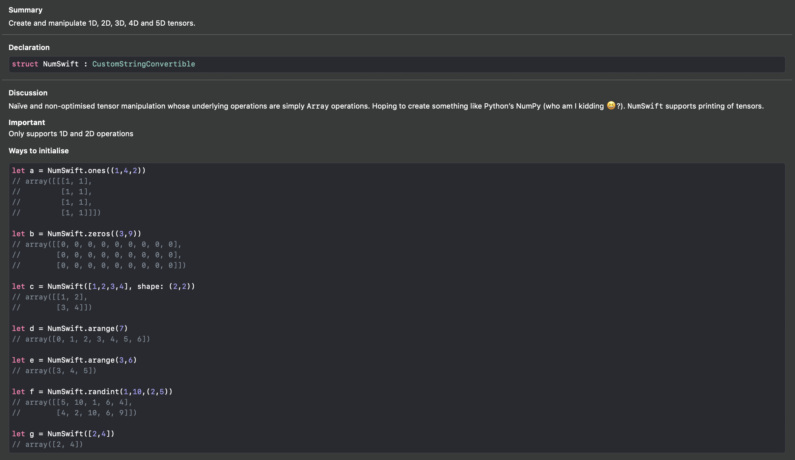

# NumSwift

Create and manipulate 1D, 2D, 3D, 4D and 5D tensors.

Naïve and non-optimised tensor manipulation whose underlying operations are simply `Array` operations. Hoping to create something like Python's NumPy (who am I kidding 😆?).

## Downloading

You can download this repo and play with it in Xcode's Playground.

## Usage

The APIs are designed to mimic those from NumPy. Here are the ways you can initialise:

```swift
let a = NumSwift.ones((1,4,2))
// array([[[1, 1],
//         [1, 1],
//         [1, 1],
//         [1, 1]]])

let b = NumSwift.zeros((3,9))
// array([[0, 0, 0, 0, 0, 0, 0, 0, 0],
//        [0, 0, 0, 0, 0, 0, 0, 0, 0],
//        [0, 0, 0, 0, 0, 0, 0, 0, 0]])

let c = NumSwift([1,2,3,4], shape: (2,2))
// array([[1, 2],
//        [3, 4]])

let d = NumSwift.arange(7)
// array([0, 1, 2, 3, 4, 5, 6])

let e = NumSwift.arange(3,6)
// array([3, 4, 5])

let f = NumSwift.randint(1,10,(2,5))
// array([[5, 10, 1, 6, 4],
//        [4, 2, 10, 6, 9]])

let g = NumSwift([2,4])
// array([2, 4])
```

Some operations that you can do:

```swift
let p = a + 1
print(p)

let q = NumSwift.ones((2,3,2)) * 7 + NumSwift.zeros((2,3,2))
print(q)
```

## Features

- [x] Pretty printing (for 1D to 3D tensors)
- [ ] Pretty printing (for 4D to 5D tensors)
- [x] Broadcasting
- [x] Subscriptable
- [x] Flattening
- [x] Element-wise addition
- [x] Element-wise subtraction
- [x] Element-wise multiplication
- [ ] Matrix multiplication
- [x] Support for `Int` operations
- [ ] Support for `Float` operations
- [ ] Dot product

## Operator Overloading

- addition, `+`
- subtraction, `-`
- multiplication, `*`

## Bonus: Pretty Documentation

One thing I like about Swift is that with some Markdown, your documentations are generated on the fly. In Playgrounds, click on the NumSwift `struct` definition to see the following:


